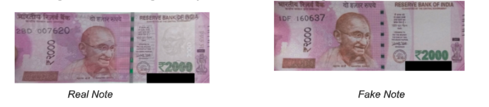
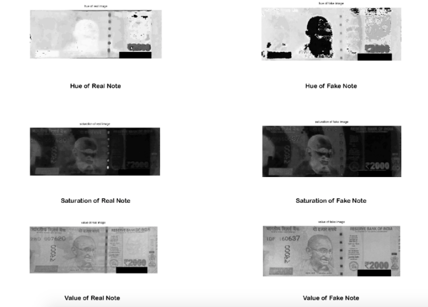
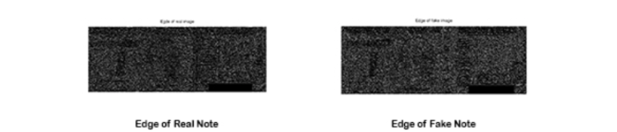
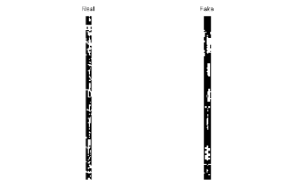
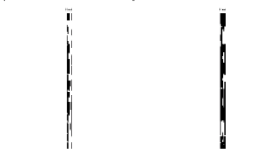

# Fake Note Detection using Image Processing

## Abstract:
Counterfeit notes have always been at the forefront of the woes of any country. All countries have
added security measures within their currency to differentiate them from fake notes. However with
advances in printing technology it is becoming easier to duplicate these securities. Also many of
these securities cannot be taken advantage of with an untrained eye. It would be simpler to use a
machine to differentiate between a fake and real images. But currently such machines are not
readily available. We have proposed several techniques using MATLAB to distinguish between fake
and real notes. We have used edge detection, hsv color space, rgb intensity comparison and
counting green strips in the note.

## 1. Introduction
In India only the Reserve Bank of India (RBI) has the authority to issue bank notes. Like nations all
over the world the RBI changes the design of notes occasionally. Usually, anti-counterfeiting
measures involve including fine detail with raised intaglio printing on bills which allows non-experts
to easily spot forgeries. On coins, milled or marked with parallel grooves edges are used to show
that none of the valuable metal has been scraped off. The RBI uses many such techniques to make
counterfeiting currency difficult. But this has not alluded people to stop trying.

## 2. General Procedure
To test whether a given note is fake or not we will compare each pixel to a sample real note and get
the average difference in the rgb intensity values over the entire image.

rgb difference ratio= sum( abs(Real_Image(:)-Fake_Image(:)) &gt; eps ) / numel(Real_Image)

In this case the difference comes out to be 52.71%. This difference is just the average difference in
all the pixel intensities. The differences can be seen in the above images where the most basic
difference noticeable is the absence of watermarks in the fake notes.

To further verify the authenticity of the note the hsv characteristics are compared.

As can be seen Hue, Saturation and Value of an image are extremely sensitive to changes.
So the difference measured between a fake and real image can be expected to be great. The
sensitivity of the hsv characteristics of an image means the difference ratio must be very high to be
sure the image is fake.
In this case the difference in the Hue is 92.02%, the difference in the Saturation is 96.69% and the
difference in the Value is 95.38%.

## 3. Counting Green Strips

In Real Notes the silver strip will appear as a single strip but in most counterfeit notes it will appear
as multiple segments.
The first step in this procedure would be to extract the region of Interest which in this case would be
the silver strip. Then we will use the hsv characteristic to convert the strips to simplify the
comparison of the strips.

After this we will remove any small spots which remain in the strip to get a complete strip. This is
necessary to get a clean strip instead of bits and peices.

The next step will be to count the number of strips. If it is not one then the note is fake.

## 4. Conclusion
There are many techniques to identify a fake note which we have discussed. The General
Procedures can give us a percentage likelihood of whether the note is fake or not. The Counting
Green Strips technique can give us a definite answer about whether the note is fake or not.

## 5. References
Binod Prasad Yadav, C. S. Patil, R. R. Karhe, P. H. Patil “Indian Currency Recognition and
Verification System Using Image Processing ” IJARCSSE Volume 4, Issue 12, pp. 943-947,
December 2014
D.Alekhya , G.DeviSuryaPrabha , G.VenkataDurgaRao “Fake Currency Detection Using Image
Processing and Other Standard Methods” IJRCCT Vol 3, Issue 1, pp. 128-131, January- 2014
Chinmay Bhurke, Meghana Sirdeshmukh, Prof. Mrs. M.S.Kanitkar “Currency Recognition Using
Image Processing” IJIRCCE Vol. 3, Issue 5, pp. 4418-4422, May 2015
M.Deborah. P, PC.Soniya Prathap “Detection of Fake currency using Image Processing” IJISET Vol.
1 Issue 10, pp. 151-157, December 2014
